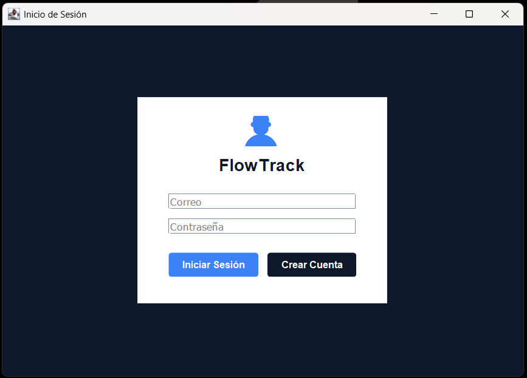
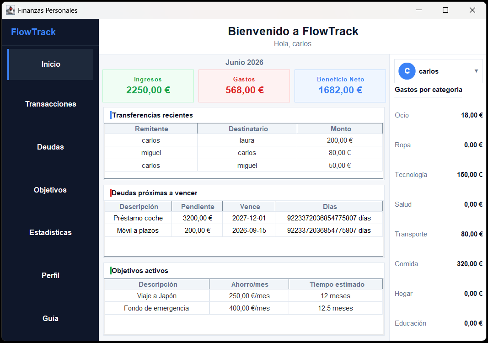
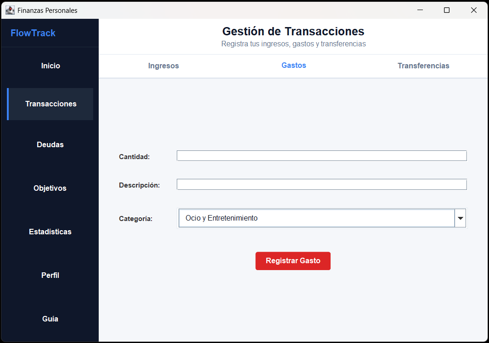
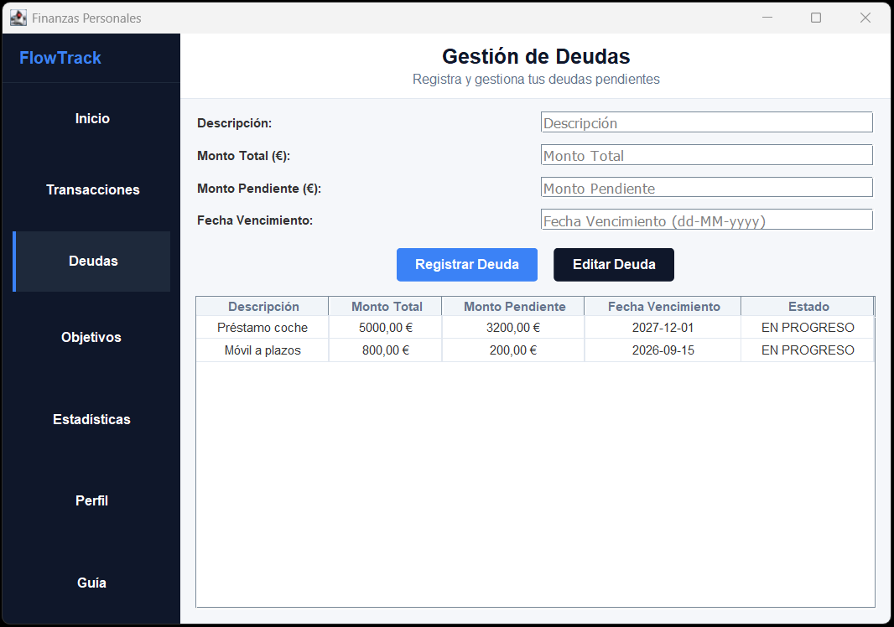
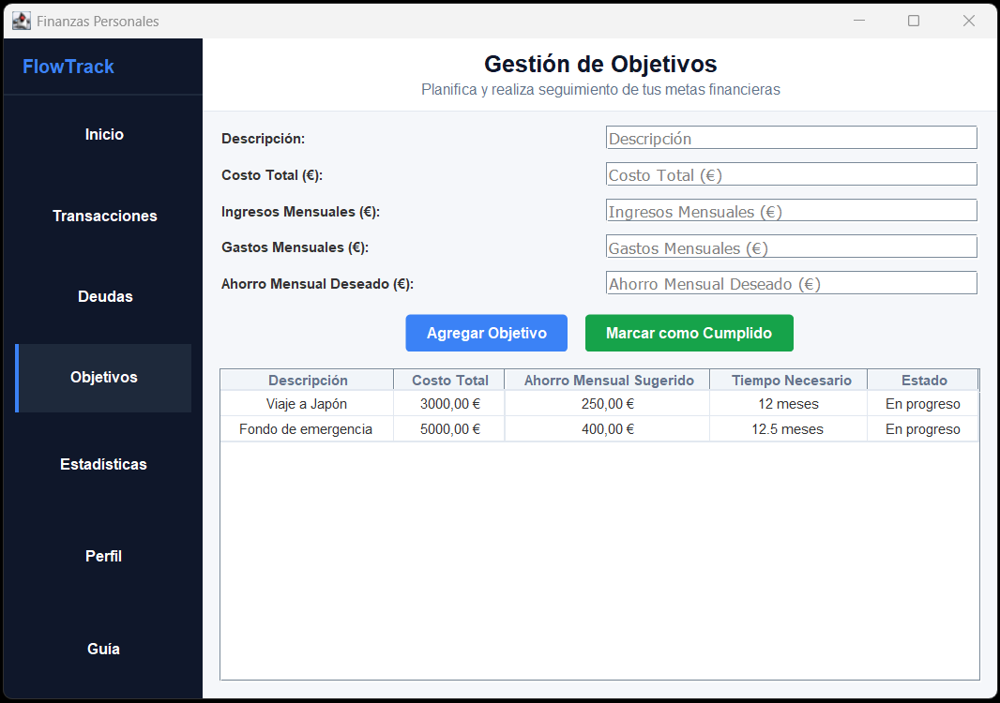
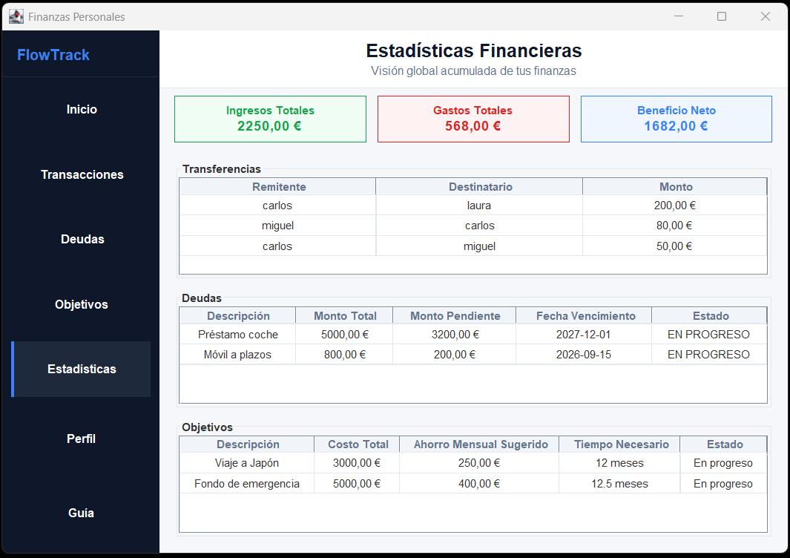
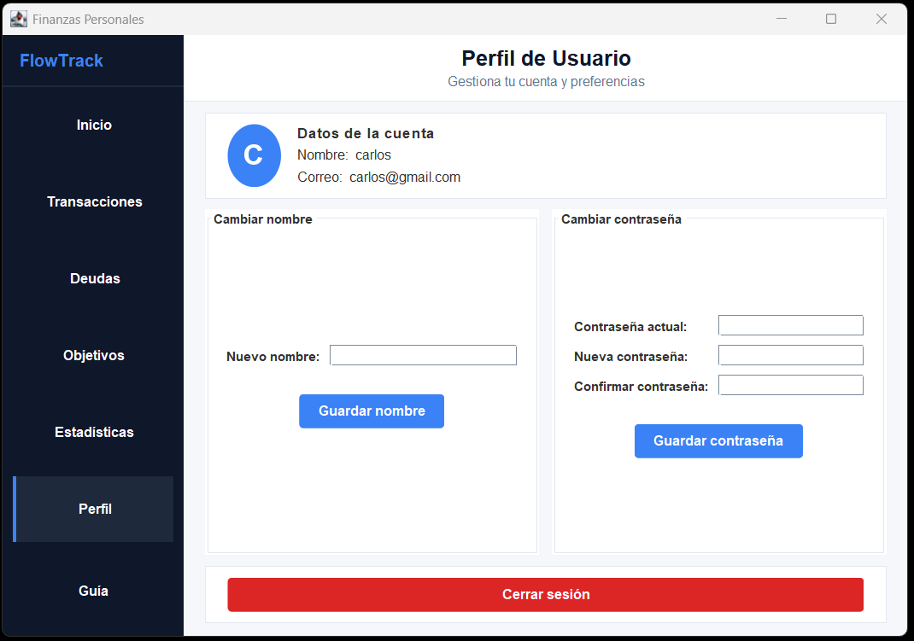
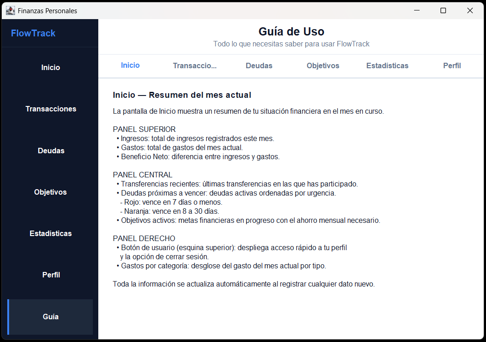

# FlowTrack

Aplicación de escritorio para la gestión de finanzas personales desarrollada en Java con Swing. Permite registrar ingresos, gastos, transferencias entre usuarios, deudas y objetivos de ahorro, con un panel de inicio que muestra el resumen financiero del mes en curso.

## Stack tecnológico

| Tecnología | Uso |
|---|---|
| Java 21 | Lenguaje principal |
| Swing (javax.swing) | Interfaz gráfica de escritorio |
| SQLite + sqlite-jdbc | Base de datos embebida |
| Gradle 8 | Gestión del proyecto y dependencias |

La arquitectura sigue el patrón **MVC**: la capa `model` gestiona los datos y el acceso a la base de datos, la capa `view` contiene los paneles Swing, y `control` coordina la lógica de la sesión.

## Funcionalidades

- **Inicio de sesión y registro** — autenticación por correo y contraseña con límite de 3 intentos fallidos antes del cierre automático.
- **Transacciones** — registro de ingresos, gastos (con 8 categorías) y transferencias entre usuarios mediante un desplegable con los usuarios registrados.
- **Deudas** — alta y seguimiento de deudas con monto total, monto pendiente, fecha de vencimiento y estado automático (EN PROGRESO / FINALIZADO).
- **Objetivos financieros** — planificación de metas de ahorro con costo objetivo, ahorro mensual sugerido y tiempo estimado.
- **Estadísticas** — visión global acumulada de ingresos, gastos, transferencias, deudas y objetivos desde el primer uso.
- **Perfil de usuario** — cambio de nombre y contraseña con validaciones, y cierre de sesión.
- **Guía de uso** — ayuda integrada en la propia app que documenta cada sección.

## Requisitos

- **JDK 21** o superior ([descargar](https://adoptium.net/))
- Git

> No se necesita instalar SQLite ni ninguna dependencia adicional. El driver JDBC y la base de datos están incluidos en el repositorio.

## Instalación y ejecución

```bash
# 1. Clonar el repositorio
git clone https://github.com/tu-usuario/Flow-Track-DAM-Integrador.git
cd Flow-Track-DAM-Integrador

# 2. Ejecutar la aplicación (Windows)
.\gradlew.bat run

# 2. Ejecutar la aplicación (Linux / macOS)
./gradlew run
```

La primera vez que se ejecute Gradle descargará las dependencias necesarias automáticamente.

## Usuarios de prueba

La base de datos incluida en el repositorio contiene los siguientes usuarios para probar la aplicación sin necesidad de registrarse:

| Correo | Contraseña |
|---|---|
| `carlos@gmail.com` | `1234abcd` |
| `laura@gmail.com` | `1234abcd` |
| `miguel@gmail.com` | `1234abcd` |

> Si quieres crear tu propio usuario, pulsa **"Crear Cuenta"** en la pantalla de inicio de sesión. El correo debe tener formato `nombre@gmail.com` y la contraseña un mínimo de 8 caracteres.

## Estructura del proyecto

```
Flow-Track-DAM-Integrador/
├── src/
│   └── com/dam/finanzas/
│       ├── main/
│       │   └── Inicio.java                  # Punto de entrada (main)
│       ├── control/
│       │   └── AppControlador.java          # Controlador de login y registro
│       ├── model/
│       │   ├── Usuario.java
│       │   ├── Gasto.java
│       │   ├── Ingreso.java
│       │   ├── Deuda.java
│       │   ├── ObjetivoFinanciero.java
│       │   ├── Transferencia.java
│       │   ├── SesionUsuario.java           # Singleton de sesión activa
│       │   └── bbdd/
│       │       ├── ConexionBBDD.java        # Gestión de la conexión SQLite
│       │       ├── TablaUsuario.java
│       │       ├── TablaGastos.java
│       │       ├── TablaIngresos.java
│       │       ├── TablaDeuda.java
│       │       ├── TablaObjetivoFinanciero.java
│       │       ├── TablaTransferencia.java
│       │       └── TablaEstadistica.java
│       └── view/
│           ├── UIUtils.java                 # Paleta de colores y helpers de estilo
│           ├── LoginView.java
│           ├── RegisterView.java
│           ├── MainView.java                # Ventana principal con sidebar y CardLayout
│           ├── TransaccionesView.java
│           ├── DeudasView.java
│           ├── ObjetivosView.java
│           ├── EstadisticasView.java
│           ├── PerfilView.java
│           └── GuiaView.java
├── BBDD/
│   └── Prueba1PIntegrador.db               # Base de datos SQLite
├── lib/
│   └── sqlite-jdbc-*.jar                   # Driver JDBC para SQLite
├── build.gradle
├── settings.gradle
└── gradlew / gradlew.bat
```

## Capturas de pantalla

### Inicio de sesión


### Inicio — resumen del mes


### Transacciones


### Deudas


### Objetivos financieros


### Estadísticas


### Perfil de usuario


### Guía de uso


---

Proyecto desarrollado como trabajo integrador del ciclo formativo de Desarrollo de Aplicaciones Multiplataforma (DAM).
